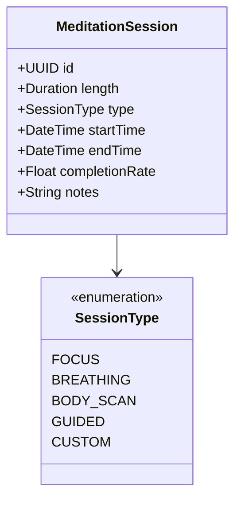
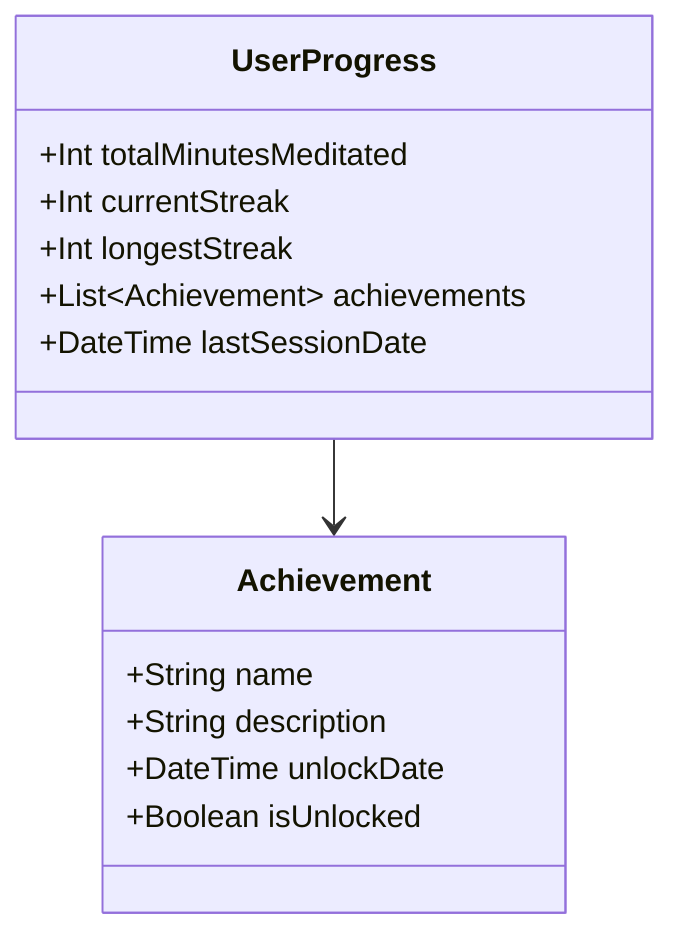

# 🧘 Meditation App Domain Model

## Core Concepts

### 1. Meditation Session
- The fundamental unit of meditation practice
- Represents a single meditation activity
- Contains duration, type, and completion metrics



### 2. User Progress
- Tracks user's meditation journey
- Records streaks and milestones
- Manages achievement system



## Business Rules

### 1. Session Rules
- Minimum session duration: 1 minute
- Maximum session duration: 24 hours
- Session can be paused and resumed
- Completion rate calculated based on actual vs planned duration

### 2. Streak Rules
- Daily streak increases with at least one session per day
- Streak breaks if no session within 24 hours of last session
- Grace period of 1 day for maintaining streak
- Multiple sessions per day count as single day for streak

### 3. Achievement Rules
- Achievements unlocked based on:
    - Cumulative meditation time
    - Streak length
    - Session completion rate
    - Variety of meditation types tried
    - Special events or challenges completed

## User Journey

### 1. Beginner Path
1. App Introduction
2. Guided breathing exercise
3. First short meditation (2-5 minutes)
4. Basic technique introduction
5. Daily reminder setup

### 2. Intermediate Progress
1. Longer session durations
2. Different meditation techniques
3. Custom session configuration
4. Statistics tracking
5. Community features

### 3. Advanced Features
1. Complex breathing patterns
2. Custom meditation programs
3. Progress insights
4. Meditation journaling
5. Offline session support

## Feature Categories

### 1. Core Meditation
- Timer with bells
- Guided sessions
- Breathing exercises
- Progress tracking
- Session history

### 2. User Experience
- Customizable themes
- Sound options
- Haptic feedback
- Widget support
- Daily reminders

### 3. Social Features
- Achievement sharing
- Community challenges
- Group sessions
- Progress comparisons
- Meditation tips

## Data Model

### 1. User Profile
```kotlin
data class UserProfile(
    val id: UUID,
    val name: String,
    val joinDate: LocalDateTime,
    val preferences: MeditationPreferences,
    val progress: UserProgress
)

data class MeditationPreferences(
    val defaultDuration: Duration,
    val preferredMeditationType: SessionType,
    val soundEnabled: Boolean,
    val hapticEnabled: Boolean,
    val darkModeEnabled: Boolean,
    val reminderTime: LocalTime?
)
```

### 2. Session Data
```kotlin
data class MeditationSession(
    val id: UUID,
    val userId: UUID,
    val type: SessionType,
    val duration: Duration,
    val startTime: LocalDateTime,
    val endTime: LocalDateTime?,
    val completionRate: Float,
    val notes: String?,
    val mood: MoodRating?
)

enum class MoodRating {
    VERY_CALM,
    CALM,
    NEUTRAL,
    ANXIOUS,
    VERY_ANXIOUS
}
```

## Integration Points

### 1. External Services
- Health app integration (Apple Health, Google Fit)
- Calendar integration for reminders
- Social media sharing
- Cloud backup service
- Analytics platform

### 2. Internal Systems
- Authentication service
- Push notification system
- Analytics tracking
- Crash reporting
- Content delivery system

## Business Metrics

### 1. User Engagement
- Daily active users (DAU)
- Session completion rate
- Average session duration
- Retention rate
- Feature usage statistics

### 2. User Progress
- Average streak length
- Achievement unlock rate
- Session frequency
- User progression through levels
- Community participation rate

## Future Considerations

### 1. Planned Features
- Group meditation sessions
- Live guided sessions
- Custom meditation program creation
- Advanced statistics and insights
- Meditation journal integration

### 2. Scalability Concerns
- User data growth
- Session recording storage
- Real-time session management
- Push notification scaling
- Analytics data processing

### 3. Potential Integrations
- Wearable device support
- Smart home integration
- Voice assistant compatibility
- Third-party content providers
- Health platform partnerships